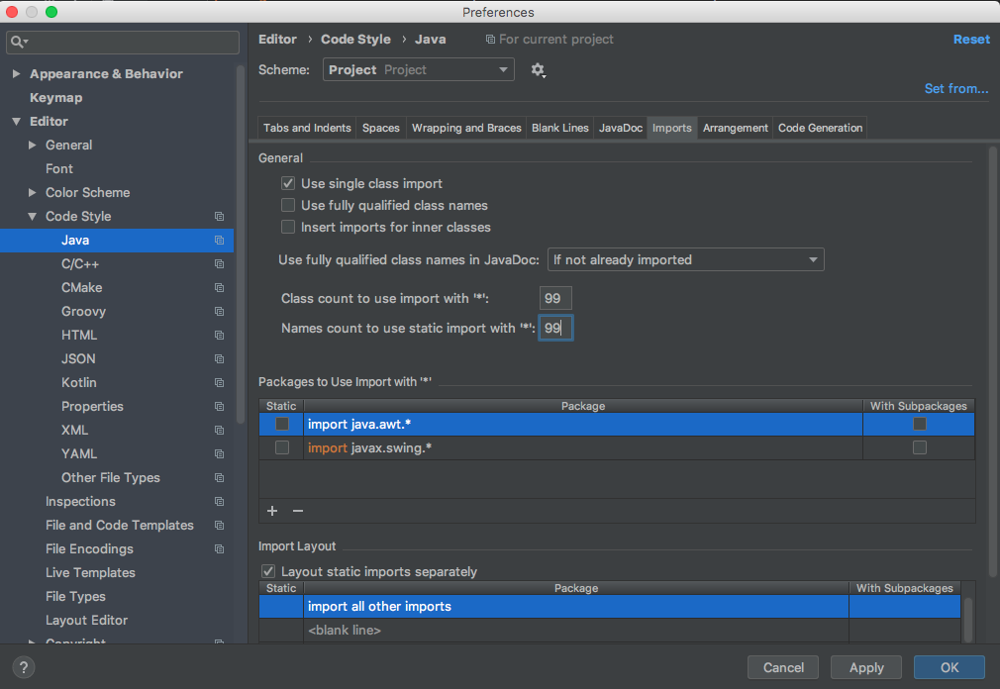

# Android Studio Style Guide

The intention of this guide is to provide a set of conventions that ensure Android Studio is configured correctly across developers machines.

## Disable wildcard imports for Kotlin

In certain circumstances Android Studio will wildcard import by default. That default behaviour should be disabled as follows.

Go to <kbd>Preferences</kbd> -> <kbd>Editor</kbd> -> <kbd>Code Style</kbd> -> <kbd>Kotlin</kbd>
  - open <kbd>Imports</kbd> tab
    - select `Use single name import` (all of them)
    - remove `import java.util.*` from `Packages to Use Import with '*'`.
	- Keep enabled (or add if not there) `import kotlinx.android.synthetic.*` including with subpackages.

## Disable wildcard imports for Java

If your project uses Java you should also disable wildcard imports for Java.

Go to <kbd>Preferences</kbd> -> <kbd>Editor</kbd> -> <kbd>Code Style</kbd> -> <kbd>Java</kbd>
  - open <kbd>Imports</kbd> tab
    - Ensure `Use single class import` is checked
    - Set `Class count to use import with '*'` to `99`
    - Set `Names count to use static import with '*'` to `99`

